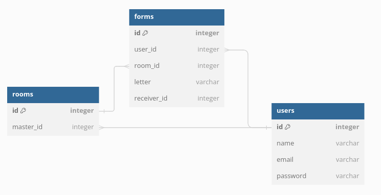

# Secret Santa project

**Описание проекта:** веб-приложение для игры в "Тайного Санту" 

Регистрация пользователей:
При регистрации пользователь указыает свою почту и пароль.

Создание комнат:
Комната может иметь уникальное имя и настройки, такие как максимальная стоимость подарка и дата обмена. При создании организатор добавляет участников вручную через ввод их email адресов. В форме участника пользователи могут указать свое имя и предпочтения по подаркам, а также указать почтовый адрес.

Розыгрыш "Тайного Санты":
После окончания регистрации участников организатор запускает процесс розыгрыша. Алгоритм случайным образом назначает каждому Санте получателя. 

Коммуникация внутри комнаты:
Участники могут общаться между собой внутри комнаты через встроенный чат.

**Технологии:** OpenJDK 21, Spring Boot 3.2.3, Maven, Hibernate, PostgreSQL
 
## Лабораторная работа №1 
#### Создание простейшего сервиса с помощью Spring Boot
Изучение материала по архитектуре веб-приложений, создание и настройка проекта, создание GET ендпоинта.

## Лабораторная работа №2
#### Подключение базы данных PostgreSQL, реализация свезей OneToMany и ManyToMany
Создание необходимых сущностей (User, Room, Form) и репозиториев для выполнения CRUD операций над данными.

Связь "**многие ко многим**" между пользователями (User) и комнатами (Room) с помощью таблицы формы(Form) и полей user_id room_id.
Связь "**один ко многим**" между пользователями (User) и комнатами (Room) с помощью поля ведущего(master_id).

Структура базы и связей таблиц:

## Лабораторная работа №3
#### Добавление кастомных запросов (@Query) с параметрами. Реализация кэша с помощью in-memory Map

Реализация DTO:
* room:
    + id 
    + info {id, UserInfoDTO master, List<UserInfoDTO> roomParticipants}
    + participants {List<UserInfoDTO> roomParticipants}
* form:
    + letter {UserNameDTO author, letter}
    + pair {UserNameDTO santa, UserNameDTO receiver}
* user:
    + name
    + info {id, name, email}

Реализация данных запросов: 

* Room
    + вся информация об участниках по id комнаты
* Form
    + имя и получатель
    + имя и письмо для Санты
* User
    + все id комнат

