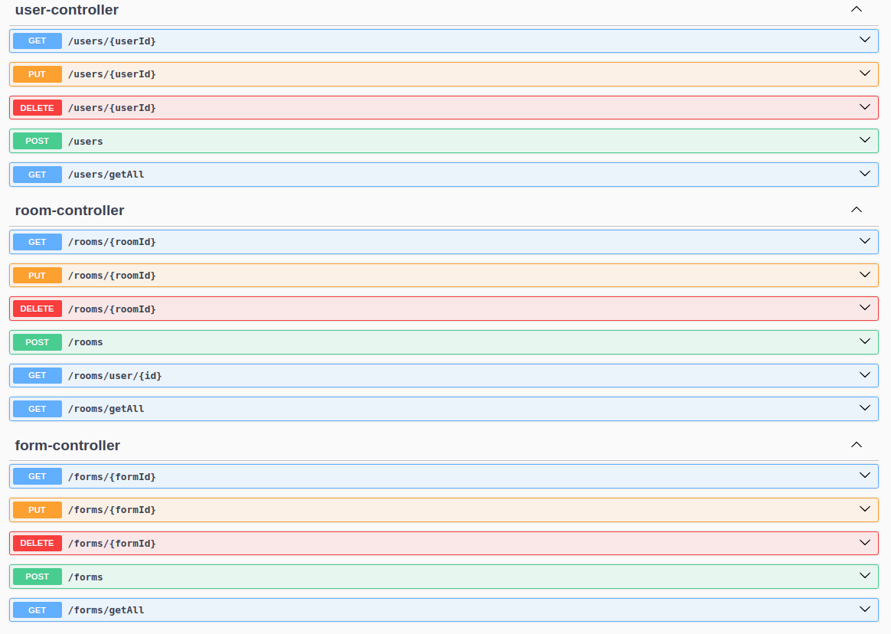
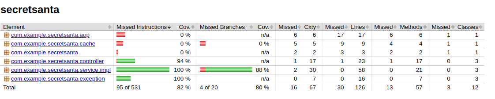

# Secret Santa project

**Описание проекта:** веб-приложение для игры в "Тайного Санту" 

Регистрация пользователей:
При регистрации пользователь указыает свою почту и пароль.

Создание комнат:
Комната может иметь уникальное имя и настройки, такие как максимальная стоимость подарка и дата обмена. При создании организатор добавляет участников вручную через ввод их email адресов. В форме участника пользователи могут указать свое имя и предпочтения по подаркам, а также указать почтовый адрес.

Розыгрыш "Тайного Санты":
После окончания регистрации участников организатор запускает процесс розыгрыша. Алгоритм случайным образом назначает каждому Санте получателя. 

Коммуникация внутри комнаты:
Участники могут общаться между собой внутри комнаты через встроенный чат.

**Технологии:** OpenJDK 21, Spring Boot 3.2.3, Maven, Hibernate, PostgreSQL
 
## Лабораторная работа №1 
#### Создание простейшего сервиса с помощью Spring Boot
Изучение материала по архитектуре веб-приложений, создание и настройка проекта, создание GET ендпоинта.


## Лабораторная работа №2
#### Подключение базы данных PostgreSQL, реализация свезей OneToMany и ManyToMany
Создание необходимых сущностей (User, Room, Form) и репозиториев для выполнения CRUD операций над данными.

Связь "**многие ко многим**" между пользователями (User) и комнатами (Room) с помощью таблицы формы(Form) и полей user_id room_id.
Связь "**один ко многим**" между пользователями (User) и комнатами (Room) с помощью поля ведущего(master_id).

Структура базы и связей таблиц:


## Лабораторная работа №3
#### Добавление кастомных запросов (@Query) с параметрами. Реализация кэша с помощью in-memory Map

Реализация запроса списка комнат пользователя: 
```
@Query("SELECT r FROM Room r JOIN r.users u WHERE u.id = :user")
    List<Room> findRoomsByUser(@Param("user") Long user);
```

Реализация кэша:
```
public class EntityCache<T> {
    Map<Long, T> cache = new HashMap<>();

    private static final int MAX = 100;

    public Optional<T> get(Long key) {
        return Optional.ofNullable(cache.get(key));
    }

    public void put(Long key, T value) {
        if (cache.size() >= MAX)
            cache.clear();
        cache.put(key, value);
    }

    public void remove(Long key) {
        cache.remove(key);
    }
}
```

## Лабораторная работа №4
#### Обработка 400 и 500 ошибок, логирование, подключение чекстайла, создание Swagger документации

Все ендпоинты проекта, сгенерированные сваггером:


## Лабораторная работа №5
#### Добавление bulk операций и Unit-тестов

Реализация bulk операции:
```
public List<User> bulkCreateUser(List<User> users) {
    if (users.stream().anyMatch(u -> (u.getName() == null || u.getName().equals("")))) {
      throw new BadRequestException("Wrong user(s) name(s)");
    }
    return users.stream().map(u -> userRepository.save(u)).toList();
  }
```

Результат покрытия тестами с помощью плагина jacoco:


## Лабораторная работа №6
#### Подсчёт обращений к основному сервису

